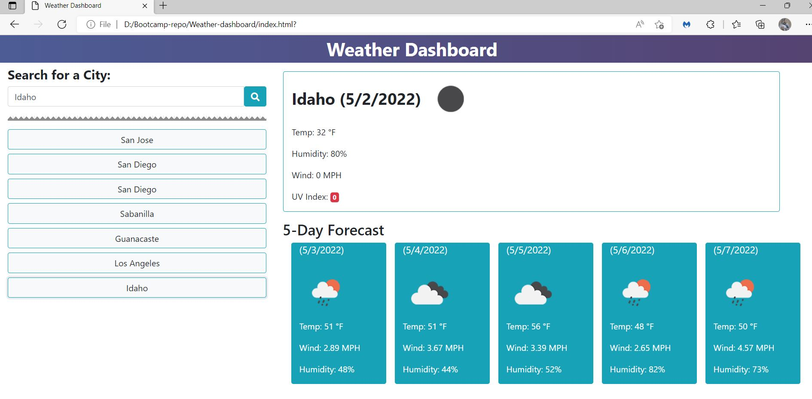

# weather-dashboard
Check the current weather conditions in your city as well as the next 5 days.  
The city search will provide temperature, wind, humidity and UV index as well as an icon that represents the overall condition for that day.  
Everytime a search is done it will be saved and be able to be clicked in to get the same information.  

Below is a screenshot of the final product.    

Visit the live page: [Lets go to Weather Dashboard!](https://ticonetster.github.io/weather-dashboard/)
